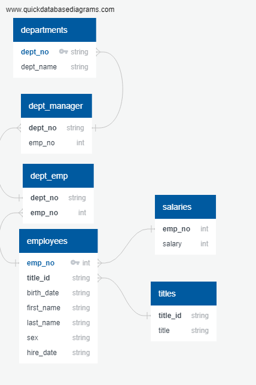

# sql-challenge-JM

#Table schema

departments
-
dept_no string PK FK >- dept_manager.dept_no
dept_name string

dept_emp
-
dept_no string
emp_no int FK >- employees.emp_no

dept_manager
-
dept_no string FK >- dept_emp.dept_no
emp_no int

employees
-
emp_no int PK FK >- salaries.emp_no
title_id string FK >- titles.title_id
birth_date string
first_name string
last_name string
sex string
hire_date string

salaries
-
emp_no int
salary int

titles
-
title_id string
title string

--#1 List the following details of each employee: employee number, last name, first name, sex, and salary.
Select e.emp_no,
	e.last_name,
	e.first_name,
	e.sex,
	s.salary
From employees e
INNER JOIN salaries s ON
e.emp_no = s.emp_no

--#2 List first name, last name, and hire date for employees who were hired in 1986.
Select first_name, 
	last_name, 
	hire_date
From employees 
WHERE hire_date between '01/01/1986' and '12/31/1986';

--#3 List the manager of each department with the following information: department number, department name, the manager's employee number, last name, first name.
select dm.dept_no,
de.dept_name,
e.emp_no,
e.first_name,
e.last_name
From employees e
INNER JOIN dept_manager dm ON
e.emp_no = dm.emp_no
INNER JOIN departments de ON
dm.dept_no = de.dept_no

--#4 List the department of each employee with the following information: employee number, last name, first name, and department name.
select e.emp_no,
e.last_name,
e.first_name,
de.dept_name
from employees e
INNER JOIN dept_emp de_emp ON
e.emp_no = de_emp.emp_no
INNER JOIN departments de ON
de_emp.dept_no = de.dept_no;

--#5 List first name, last name, and sex for employees whose first name is "Hercules" and last names begin with "B."
select first_name,
last_name,
sex
from employees
where first_name = 'Hercules' and last_name like 'B%';

--#6 List all employees in the Sales department, including their employee number, last name, first name, and department name.
select e.emp_no,
e.last_name,
e.first_name,
de.dept_name
from employees e
INNER join dept_emp de_emp ON
e.emp_no = de_emp.emp_no
INNER join departments de ON
de_emp.dept_no = de.dept_no;

--#7 List all employees in the Sales and Development departments, including their employee number, last name, first name, and department name.
select e.emp_no,
e.last_name,
e.first_name,
de.dept_name
from employees e
INNER join dept_emp de_emp ON
e.emp_no = de_emp.emp_no
INNER join departments de ON
de_emp.dept_no = de.dept_no
where de.dept_name = 'Sales' OR de.dept_name = 'Development'

--#8 In descending order, list the frequency count of employee last names, i.e., how many employees share each last name.
select last_name,
count(last_name) as "Frequency"
from employees
group by last_name
order by
count(last_name) DESC;
